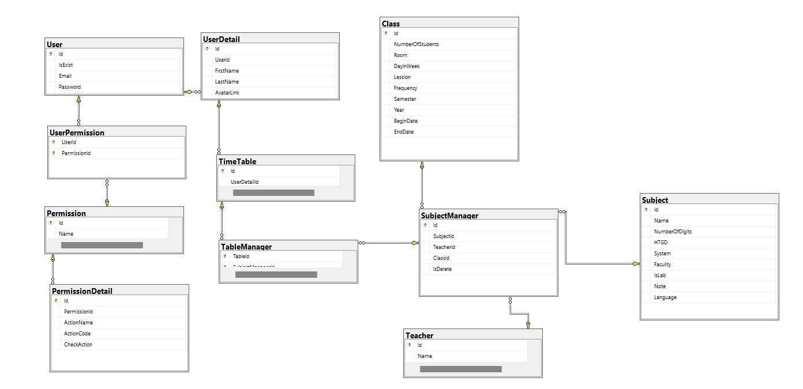

# Introduce project

- The time table project use wpf and entity framework with the MVVM model

# The Features in apps

# For development

- After clone the project, open terminal in your project, type git checkout develop, then create a new branch with name convention below

## Installation

**1. Database Framework:**

- Microsoft.EntityFrameworkCore
- Microsoft.EntityFrameworkCore.SqlServer 
  PM> Install-Package Microsoft.EntityFrameworkCore.SqlServer
- Connect entity with models by DbFirst
  - Open Tools -> Nuget Package Manager -> Package Manager Console -> type command:  
    PM> Scaffold-DbContext "Server=STILUX;Database=TOUS;Trusted_Connection=True;TrustServerCertificate=True;" Microsoft.EntityFrameworkCore.SqlServer -OutputDir Models 
  - Note: 
    - [Server is your server name you can't see the hint in this site:](https://stackoverflow.com/questions/72009430/how-can-i-use-db-first-approach-in-net-core-6)   
    - Database is your database name

**2. Excel Framework:**

- Microsoft.Office.Interop.Excel

## Code Convention

[**1. Sql server name convention:**](https://github.com/ktaranov/sqlserver-kit/blob/master/SQL%20Server%20Name%20Convention%20and%20T-SQL%20Programming%20Style.md)

**2. Git branch name convention:**

- author_feature_branch-name
- Note:
  - author is coder name
  - branch-name is lowercase and separate by "-"

[**3. C# code convention:**](https://learn.microsoft.com/en-us/dotnet/csharp/fundamentals/coding-style/coding-conventions)

## Design

- <https://www.figma.com/file/ziPIxtmgZSOakax4XBTcOe/Demo?node-id=0%3A1&t=RAIXHg2XJCMXlSCf-1>

## Database diagram

# Author

1. Tran Vo Son Tung
2. Nguyen Van Quoc Tuan
3. Nguyen Phu Thinh
4. Le Doan Tan Tri
5. Vu Hoang Quan
