# Introduce project

- The time table project use wpf and entity framework with the MVVM model

# The Features in apps

# For development

- After clone the project, open terminal in your project, type git checkout develop, then create a new branch with name convention below

## Installation

**1. Database Framework:**
- Step 1: Check if installed packages
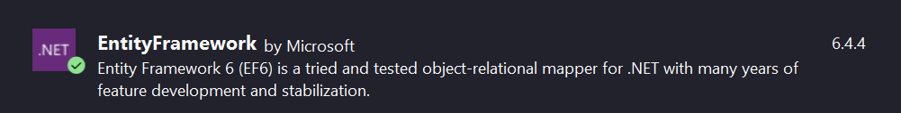

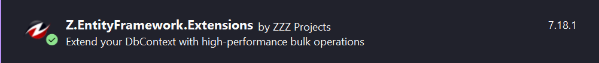

- Step 2: Run the file ToUsQuery.sql in ssms to create db
- Step 3: When you pull or clone from develop branch please open Models folder and remove ToUs.edxm and connect again

- Step 4: Connect
  - 1: Right click to folder Models -> add -> new item
  - 2: Choose Ado.Net Entity Data Model rename ToUs
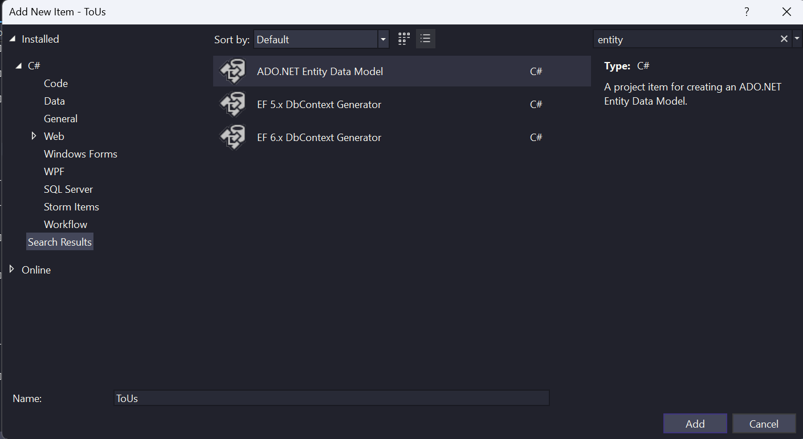
  - 3: Choose Entity Form Database then click Next
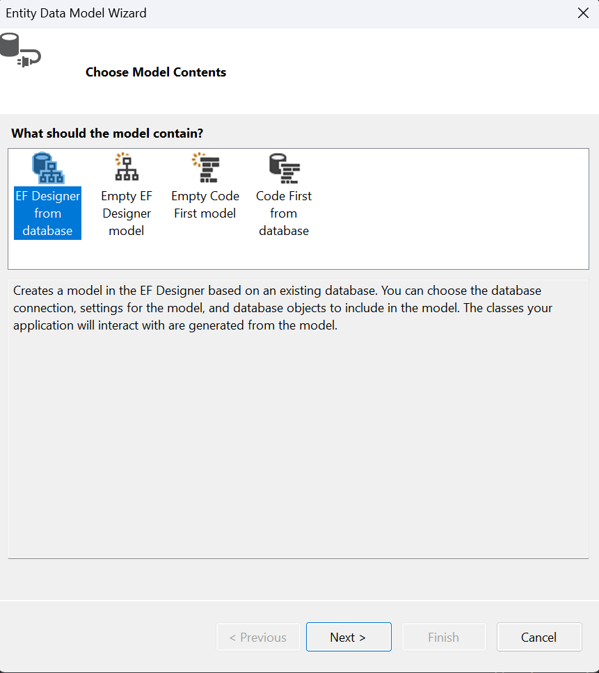
  - 4: Choose New Connection
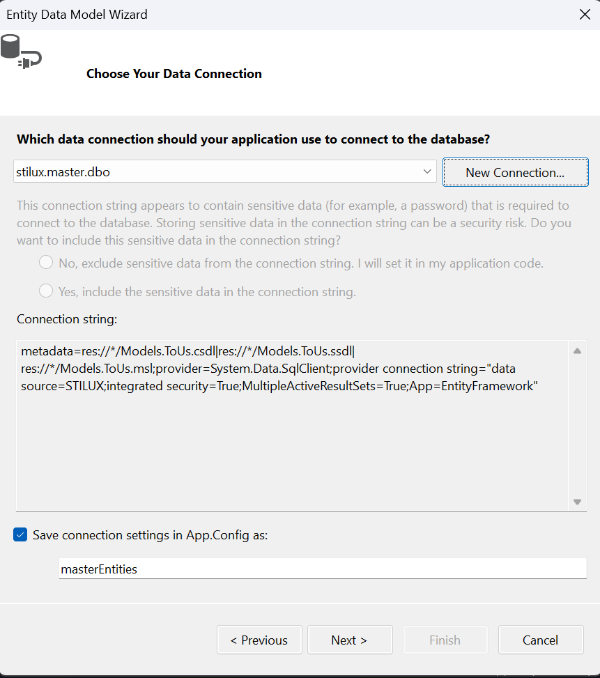
  - 5: Enter your server name and choose db TOUS, server name can be see in ssms
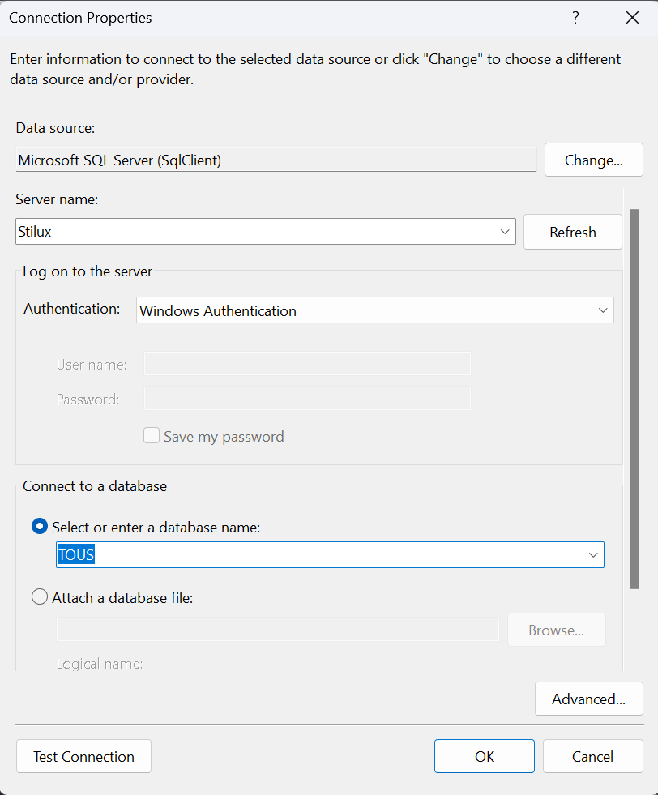
  - 6: Check if the name is TOUSEntites
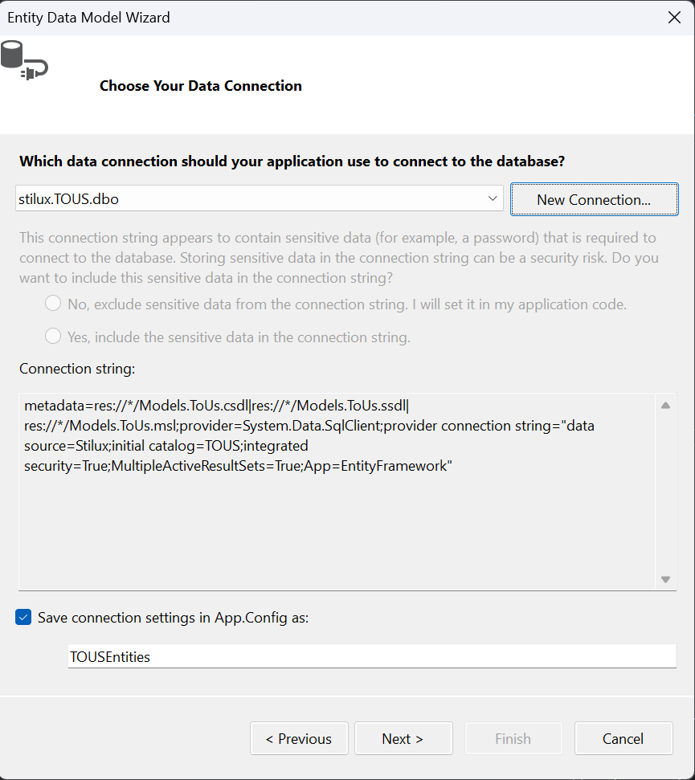
  - 7: Untick diagram if existed then click finish
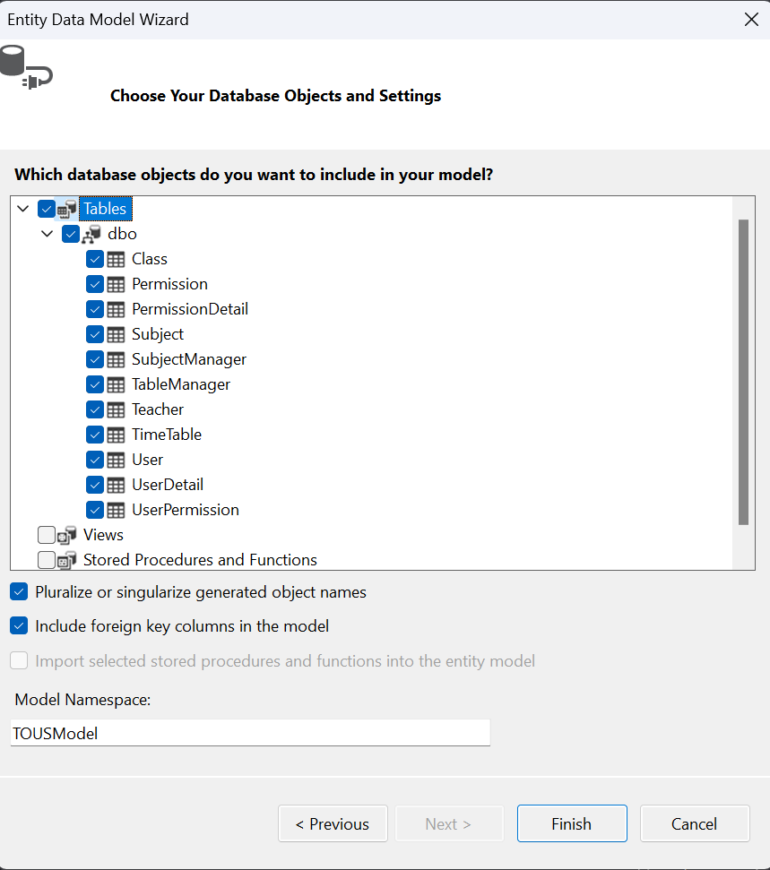
  - 8: Done

**2. Excel Framework:**
- Check if installed packages
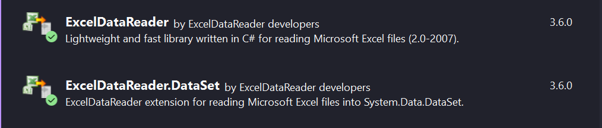
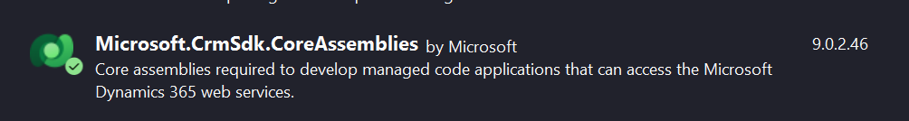

**3. UI Framework:**
- Check if installed packages
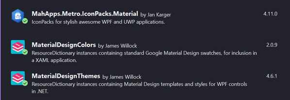

## Code Convention

[**1. Sql server name convention:**](https://github.com/ktaranov/sqlserver-kit/blob/master/SQL%20Server%20Name%20Convention%20and%20T-SQL%20Programming%20Style.md)

**2. Git branch name convention:**

- author_feature_branch-name
- Note:
  - author is coder name
  - branch-name is lowercase and separate by "-"

[**3. C# code convention:**](https://learn.microsoft.com/en-us/dotnet/csharp/fundamentals/coding-style/coding-conventions)

## Design

- <https://www.figma.com/file/ziPIxtmgZSOakax4XBTcOe/Demo?node-id=0%3A1&t=RAIXHg2XJCMXlSCf-1>

## Database diagram

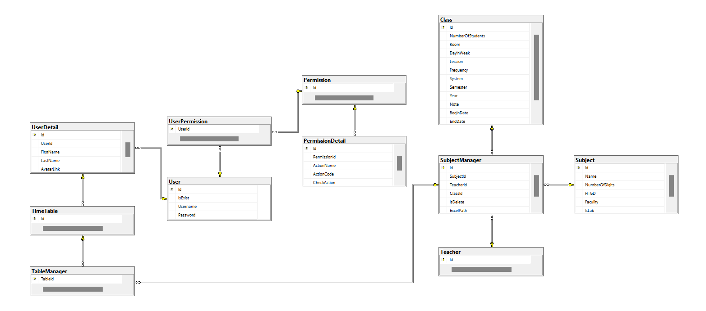

# Author

1. Tran Vo Son Tung
2. Nguyen Van Quoc Tuan
3. Nguyen Phu Thinh
4. Le Doan Tan Tri
5. Vu Hoang Quan
